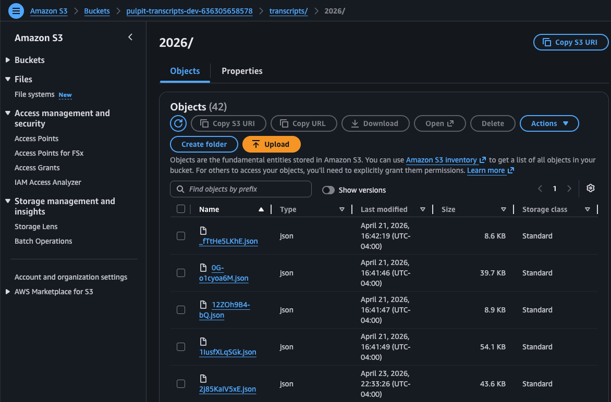
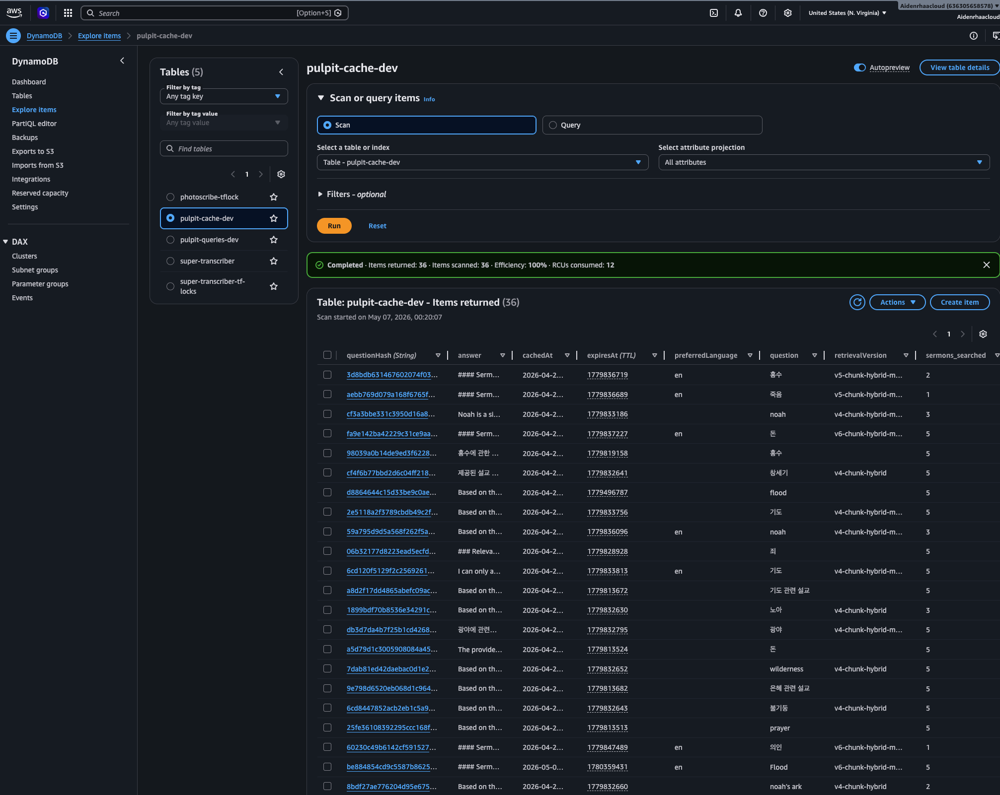
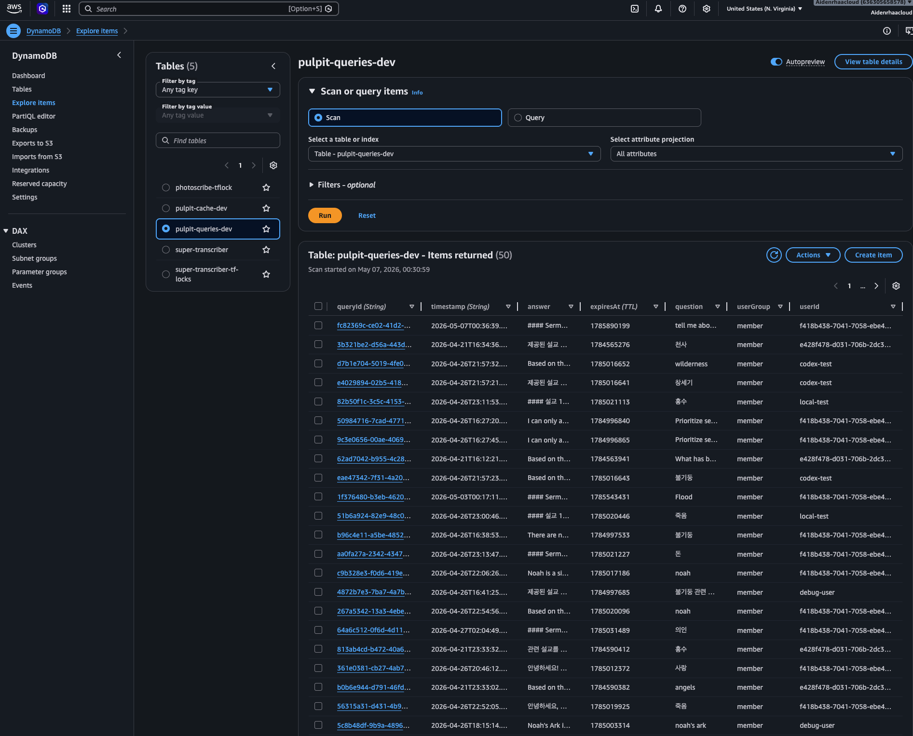
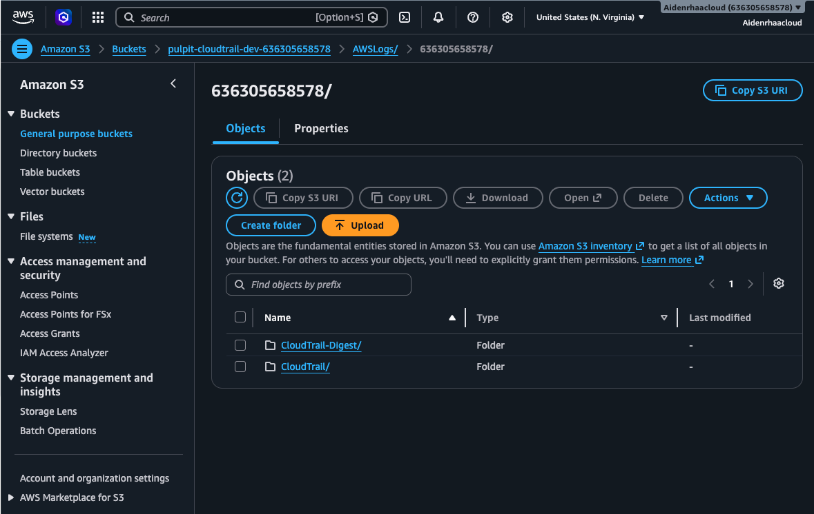

# Pulpit

Serverless bilingual sermon RAG built with AWS Bedrock, Lambda, Cognito, DynamoDB, S3, Terraform, GitHub Actions, and Cloudflare Pages.

[](https://github.com/manynames3/pulpit/actions/workflows/ci.yml)

Pulpit is a production-style retrieval application for a Korean-English sermon archive. It ingests YouTube captions, builds a chunked hybrid search index, and serves authenticated, cited answers through a low-idle-cost AWS backend with Terraform-managed infrastructure, audit logging, cache invalidation, and CI validation.

**Positioning:** A cloud/platform engineering work sample focused on practical serverless architecture, operational ownership, and cost-aware RAG.

**Live demo:** [https://pulpit.pages.dev](https://pulpit.pages.dev)

Verified reachable on 2026-05-24. The app is church-specific and requires Cognito sign-in for archive access.

## Problem

Uploading sermon transcripts into a general chat product creates one-off answers, but not a durable archive. The church needed a searchable, shared, auditable way to answer questions like "Has Pastor preached on this topic, passage, or question?" without running expensive always-on search infrastructure.

## Solution

Pulpit splits the system into three planes:

- A static frontend on Cloudflare Pages.
- An AWS serverless query path using API Gateway, Cognito, Lambda, DynamoDB, S3, Bedrock models, and Bedrock Guardrails.
- A local ingestion runner that handles YouTube caption collection, enriches sermon records, generates embeddings, and publishes a versioned S3 search index.

The design intentionally avoids a managed vector database for the current archive size. Retrieval uses a prebuilt S3 index, Lambda warm-cache reuse, semantic scoring, BM25-style lexical matching, bilingual synonym expansion, reranking, cited source snippets, and answer-cache keys tied to the current index marker.

## Operational Value

- Low idle cost: static frontend, pay-per-use Lambda/API Gateway/DynamoDB/Bedrock, and S3-backed index storage.
- Real access control: Cognito protects query and catalog endpoints.
- Auditability: query and response records are written to DynamoDB with TTL.
- Recovery discipline: Terraform-managed resources, S3 versioning, cache TTLs, and dev teardown support.
- Practical ingestion: local runner avoids YouTube transcript blocking from cloud IP ranges without adding proxy infrastructure.

## Tech Stack

| Layer | Technology |
|---|---|
| Frontend | Static HTML/CSS/JavaScript, Cloudflare Pages |
| API | API Gateway REST API, Lambda Python 3.12 |
| Auth | Amazon Cognito user pools and groups |
| Retrieval | S3 index, Titan embeddings, Lambda ranking logic |
| LLM | Amazon Bedrock models and Bedrock Guardrails |
| Data | S3, DynamoDB cache, DynamoDB query log |
| Infrastructure | Terraform modules, GitHub Actions |
| Ingestion | Python local runner, YouTube Data API, `yt-dlp`, `youtube-transcript-api` |
| Validation | Python regression tests, Terraform fmt/validate, Checkov, static JS syntax check |

## Engineering Highlights

- **Serverless RAG without a vector database.** The current archive fits in a Lambda-friendly S3 index, avoiding OpenSearch or external vector-store idle cost.
- **Index-aware answer cache.** Cached answers include retrieval version, config version, synonym version, language, and the current S3 index marker so new archive data invalidates stale answers automatically.
- **Bilingual retrieval quality work.** Query expansion, Korean token normalization, BM25-style chunk scoring, semantic similarity, diversity controls, and source snippets improve Korean-English search behavior.
- **Auth and audit boundaries.** Cognito protects APIs, admin ingest triggers check Cognito groups, and query records are logged to DynamoDB.
- **Operationally honest ingestion.** The reliable ingestion path is local because YouTube blocks the caption-scraping path from AWS IP ranges; the cloud ingestion Lambda remains documented as a legacy/secondary path.
- **Deployment discipline.** Terraform defines AWS resources, CI validates infrastructure, and deploys are explicit rather than auto-applied.

## Architecture

Detailed architecture and operating notes:

- [Architecture overview](docs/architecture.md)
- [Reviewer guide](docs/reviewer-guide.md)
- [Deployment](docs/deployment.md)
- [Runbook](docs/runbook.md)
- [Security](docs/security.md)
- [Observability](docs/observability.md)
- [Cost model](docs/cost-model.md)
- [Testing](docs/testing.md)
- [Teardown](docs/teardown.md)
- [Tradeoffs](docs/tradeoffs.md)
- [Architecture decision records](docs/adrs/README.md)
- [Retrieval quality iterations](docs/retrieval-quality-iterations.md)

## Evidence Matrix

| Area | Evidence |
|---|---|
| IaC | Terraform root config and modules in `modules/`; `terraform fmt`, `terraform validate`, dev/prod tfvars, explicit plan workflow |
| CI/CD | GitHub Actions builds Lambda packages, runs Python checks, validates Terraform, runs Checkov, and plans dev infrastructure for trusted events |
| Security | Cognito authorizer, Cognito groups, scoped Lambda IAM policies, SSM SecureString for YouTube API key, S3 public access blocks, Bedrock Guardrails, CloudTrail |
| Reliability | SQS ingest queue with DLQ, local ingest throttles, S3 versioning, DynamoDB TTLs, Lambda error handling, explicit rollback/redeploy notes |
| Observability | CloudWatch Lambda/API logs by default, DynamoDB query audit log, retrieval eval table, CloudTrail log bucket, documented gaps for alarms/dashboards |
| Cost | Static frontend, pay-per-use AWS services, S3 index instead of search cluster, answer/planner/reranker caches, local batched ingestion |
| Operations | Runbook, deployment guide, teardown guide, troubleshooting notes, validation commands |
| Testing | Python retrieval regression tests, py_compile checks, frontend inline JS syntax check, Terraform validation, Checkov scan, optional retrieval golden-set eval |
| Documentation | Architecture doc, reviewer guide, ADRs, security/observability/cost/testing/deployment/teardown/tradeoff docs |

## Screenshots

These are AWS console screenshots already present in the repo, included as evidence of deployed resource shape. They are not synthetic test results.









## Local Quickstart

Prerequisites:

- Python 3.12
- Terraform 1.5+
- AWS CLI credentials for deployment or real ingestion
- `yt-dlp` and `ffmpeg` for local caption ingestion

Validate the repo without AWS credentials:

```bash
python3 scripts/test_korean_search.py
python3 -m py_compile lambda/query/query_service.py scripts/rebuild_index.py scripts/evaluate_retrieval.py scripts/test_korean_search.py
awk '/<script>/{flag=1; next} /<\\/script>/{flag=0} flag' frontend-alternative/index.html | node --check
terraform init -backend=false
terraform fmt -check -recursive
terraform validate
git diff --check
```

Build Lambda packages:

```bash
./scripts/build-lambda.sh
```

Run the static frontend locally:

```bash
python3 -m http.server 8767 --directory frontend-alternative
```

Then open `http://127.0.0.1:8767/`. Authenticated query calls still require the configured AWS backend.

## Running Ingestion

The reliable ingestion path is local, not cloud-hosted.

Why:

- YouTube blocks transcript scraping from AWS IP ranges.
- A local machine on a residential or church-office connection works reliably enough to backfill in small batches.
- A better option would be the official YouTube captions API, but that requires OAuth 2.0 credentials and explicit consent from the channel owner. An API key alone is not enough to access caption download methods for account-owned data.

Current runner files:

- `scripts/ingest-local.py`
- `scripts/rebuild_index.py`
- `scripts/evaluate_retrieval.py`
- `scripts/run-ingest-batch.sh`
- `scripts/install_ingest_cron.sh`
- `scripts/pulpit-ingest.env.example`

Example setup:

```bash
brew install yt-dlp ffmpeg
mkdir -p ~/.config
cp scripts/pulpit-ingest.env.example ~/.config/pulpit-ingest.env
# edit ~/.config/pulpit-ingest.env

./scripts/run-ingest-batch.sh backlog
./scripts/install_ingest_cron.sh backlog "*/30 * * * *"
```

The ingestion script fetches YouTube uploads, filters non-sermon content, downloads transcript text, extracts metadata, generates Titan embeddings, uploads sermon JSON to S3, and rebuilds `transcripts/index.json`.

## Test and Validation Commands

Common local checks:

```bash
python3 scripts/test_korean_search.py
python3 -m py_compile lambda/query/query_service.py scripts/rebuild_index.py scripts/evaluate_retrieval.py scripts/test_korean_search.py
awk '/<script>/{flag=1; next} /<\\/script>/{flag=0} flag' frontend-alternative/index.html | node --check
terraform fmt -check -recursive
terraform init -backend=false
terraform validate
./scripts/build-lambda.sh
git diff --check
```

Optional retrieval evaluation against an exported index:

```bash
python3 scripts/evaluate_retrieval.py --index /path/to/transcripts/index.json
```

## Deployment Overview

Frontend:

- Cloudflare Pages serves `frontend-alternative/`.
- `wrangler.toml` points to the deployed static directory.

AWS backend:

- Terraform provisions S3, API Gateway, Cognito, Lambda, DynamoDB, CloudTrail, Bedrock Guardrails, SQS, SSM Parameter Store, and optional GuardDuty.
- CI plans the dev environment but does not auto-apply.

Typical backend flow:

```bash
terraform init
terraform plan -var-file=environments/dev/terraform.tfvars
terraform apply -var-file=environments/dev/terraform.tfvars
```

See [docs/deployment.md](docs/deployment.md) and [DEPLOY.md](DEPLOY.md).

## Security Model Summary

- Cognito user pools authenticate browser users.
- API Gateway enforces Cognito authorization on query, catalog, and admin ingest routes.
- Admin ingest trigger checks Cognito groups before queuing SQS work.
- Lambda IAM policies are scoped to required S3, DynamoDB, SQS, SSM, Bedrock, and log actions where possible.
- YouTube API key for AWS-managed ingestion is stored as an SSM SecureString placeholder and updated after deploy.
- S3 buckets block public access; transcript bucket uses default encryption and versioning.
- Bedrock Guardrails add API-level content controls.
- CloudTrail records AWS API activity to S3.

See [docs/security.md](docs/security.md).

## Observability Model Summary

- Lambda and API Gateway emit logs to CloudWatch.
- Query/audit records are stored in DynamoDB with TTL.
- Retrieval evaluation samples can be stored in DynamoDB.
- CloudTrail writes AWS account activity to S3.
- There are no custom CloudWatch alarms or dashboards in this repo yet; that gap is documented in [docs/observability.md](docs/observability.md).

## Cost Controls Summary

- Static frontend avoids a web server.
- Lambda, API Gateway, DynamoDB on-demand, S3, and Bedrock are pay-per-use.
- S3-backed retrieval avoids always-on OpenSearch/vector database cost.
- Answer, planner, and reranker caches reduce repeat Bedrock calls.
- Local ingestion throttles and batch limits reduce YouTube blocking risk and uncontrolled model usage.
- GuardDuty is optional and disabled in dev.

See [docs/cost-model.md](docs/cost-model.md).

## Teardown and Cleanup Summary

- Dev buckets use `force_destroy = true`; prod buckets do not.
- Prod DynamoDB deletion protection is enabled for selected tables.
- Terraform destroy should be used only after preserving needed transcripts, logs, and audit records.
- Local secrets live outside git in `.env` or `~/.config/pulpit-ingest.env`.

See [docs/teardown.md](docs/teardown.md).

## Project Structure

```text
pulpit/
├── frontend/                    # Original terminal-style prototype UI
├── frontend-alternative/        # Current deployed static frontend
├── lambda/
│   ├── admin-trigger/           # Cognito-protected SQS ingestion trigger
│   ├── ingest/                  # Legacy/secondary AWS ingestion path
│   └── query/                   # Query API, catalog endpoint, retrieval logic
├── modules/
│   ├── ingestion/               # S3, SQS, EventBridge, ingest Lambda, SSM
│   ├── query/                   # API Gateway, Cognito, DynamoDB, guardrails, query Lambda
│   ├── security/                # CloudTrail and optional GuardDuty
│   └── knowledge-base/          # Previous/experimental KB path, not active in main.tf
├── environments/
│   ├── dev/
│   └── prod/
├── scripts/
│   ├── ingest-local.py
│   ├── rebuild_index.py
│   ├── evaluate_retrieval.py
│   ├── run-ingest-batch.sh
│   ├── install_ingest_cron.sh
│   └── build-lambda.sh
├── docs/
│   ├── architecture.md
│   ├── reviewer-guide.md
│   ├── runbook.md
│   ├── security.md
│   ├── observability.md
│   ├── cost-model.md
│   ├── deployment.md
│   ├── teardown.md
│   ├── tradeoffs.md
│   ├── testing.md
│   ├── adrs/
│   └── screenshots/
├── .github/workflows/ci.yml
├── DEPLOY.md
├── main.tf
├── variables.tf
├── outputs.tf
└── wrangler.toml
```

## Known Limitations

- YouTube transcript retrieval is the hardest constraint; cloud IP blocking is the reason the primary ingestion runner is local.
- Official YouTube caption download would require channel-owner OAuth 2.0 consent.
- Transcript quality depends on available YouTube captions.
- The live app is church-specific and requires Cognito access for archive queries.
- CORS is currently broad in Terraform (`Access-Control-Allow-Origin: *`) and should be tightened for a production custom domain.
- Custom CloudWatch alarms, dashboards, WAF, and automated restore drills are not yet implemented.
- The repo carries both active and legacy paths; `main.tf` uses the low-cost local-ingest architecture, while some AWS ingestion resources remain for reference and admin-triggered queueing.

## What I Would Improve Next

- Move ingestion to the official YouTube captions API if channel-owner OAuth is approved.
- Add CloudWatch alarms for Lambda errors, API 5xx, DLQ depth, and high Bedrock spend.
- Restrict CORS to the final Cloudflare Pages/custom domain.
- Add an explicit restore drill for S3 index rollback and DynamoDB audit export.
- Add a small browser smoke test for the deployed frontend and API auth path.
- Revisit OpenSearch Serverless or a managed vector store only if archive size or query latency outgrows the S3 index model.

## License

MIT
