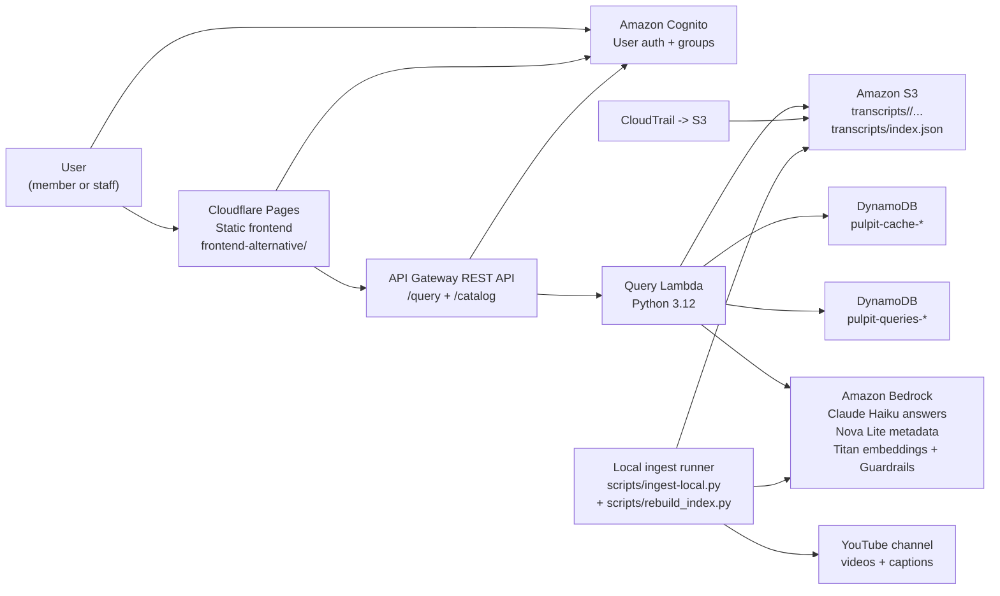

# Architecture

## Overview

Pulpit is a low-idle-cost sermon search system with three moving parts:

1. **Static frontend**
   - `frontend-alternative/` is deployed on Cloudflare Pages.
   - The browser talks directly to Cognito and the AWS API.
2. **Serverless query backend**
   - API Gateway, Cognito, Lambda, DynamoDB, S3, CloudTrail, and Bedrock live in AWS.
   - The query Lambda loads a prebuilt search index from S3 and returns cited sermon answers.
3. **Local ingestion and indexing**
   - A local Python runner pulls YouTube captions, enriches sermons with Bedrock, and publishes updated transcript JSON plus `transcripts/index.json` to S3.
   - If the channel owner grants OAuth 2.0 access, the better long-term ingestion path is the official YouTube captions API rather than transcript scraping.

The architecture intentionally avoids always-on search infrastructure such as OpenSearch. Retrieval quality is pushed into the index-building step so the query path can stay serverless.

## C4-style Container Diagram

## Runtime Flow

### Query flow

1. A signed-in user opens the static frontend.
2. The frontend authenticates against Cognito and sends requests to API Gateway.
3. API Gateway authorizes requests with Cognito user pool tokens.
4. The query Lambda:
   - checks the cache table
   - loads `transcripts/index.json` from S3 and caches it in the Lambda execution environment
   - runs chunked hybrid retrieval using semantic and lexical signals
   - calls Bedrock Guardrails and Claude Haiku 4.5 to generate the answer
   - writes audit records to DynamoDB
5. The frontend renders the answer, sources, and indexed archive catalog.

### Ingestion flow

1. A local machine runs `scripts/run-ingest-batch.sh` or `scripts/ingest-local.py`.
2. The script calls the YouTube uploads playlist API and fetches caption data.
3. It filters videos, stores sermon JSON to S3, and enriches each sermon with:
   - pastor metadata
   - topics and scripture references
   - Titan embeddings
4. `scripts/rebuild_index.py` chunks transcripts, reuses unchanged embeddings, and publishes `transcripts/index.json`.
5. The next query Lambda invocation reloads the index from S3 after the cache TTL expires.

## Deployment Shape

### Frontend

- Host: Cloudflare Pages
- Source: `frontend-alternative/`
- No build step
- Live URL: `https://pulpit.pages.dev`

### AWS backend

- Region: `us-east-1`
- Provisioned with Terraform
- Main resources:
  - S3 transcript bucket
  - API Gateway REST API
  - Cognito user pool and groups
  - Query Lambda
  - DynamoDB cache table
  - DynamoDB query log table
  - CloudTrail
  - optional GuardDuty

## Key Constraints

- **YouTube blocks cloud IPs for transcript scraping.**
  - This is why the primary ingestion path is local instead of Lambda.
- **The official YouTube captions API is only available with owner-authorized OAuth 2.0 credentials.**
  - An API key alone is not enough to download account-owned caption tracks, so this project cannot assume that path is available.
- **The query path must stay cheap at idle.**
  - That rules out always-on managed search infrastructure for the current archive size.
- **The search index must fit within Lambda-friendly latency and memory limits.**
  - The system uses a single S3 index file and Lambda execution-environment caching to keep the read path simple.
- **Answers are intentionally constrained to sermon content.**
  - The system is not a general pastoral advice bot.

## Related Documents

- [ADRs](adrs/README.md)
- [Retrieval quality iterations](retrieval-quality-iterations.md)
- [Deployment guide](../DEPLOY.md)
