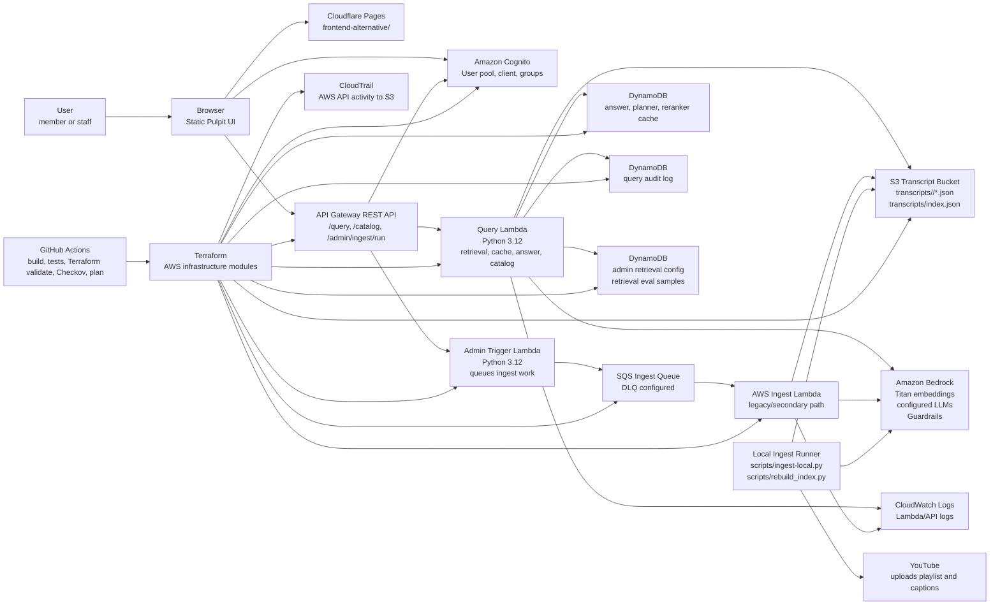
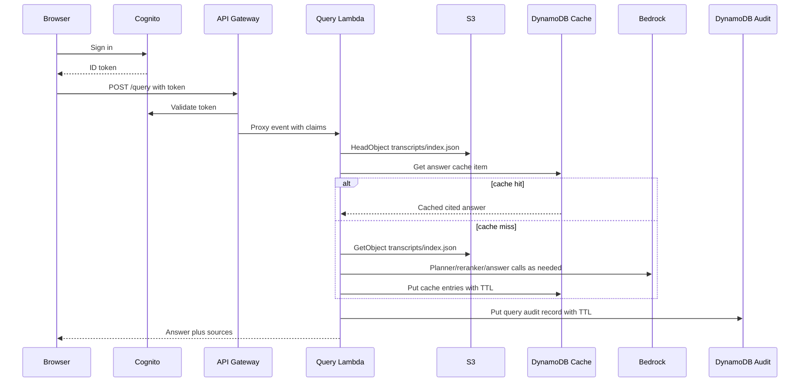
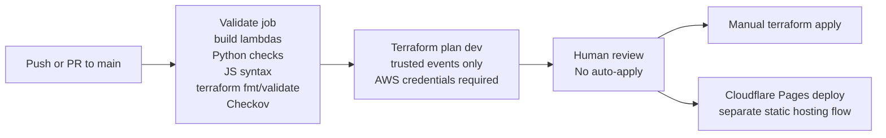

# Architecture

## Concise Overview

Pulpit is a serverless sermon retrieval system for a Korean-English archive. The browser is static, identity and query execution live in AWS, and ingestion runs from a local machine because YouTube blocks the caption-scraping path from AWS IP ranges.

The core design choice is to keep the query path low-cost at idle: S3 stores transcript JSON and a chunked `transcripts/index.json`; Lambda loads and ranks that index directly; DynamoDB stores audit logs, answer cache entries, retrieval configuration, and optional retrieval evaluation samples.

## C4-Style Container Diagram

## Runtime Flow

### Query Flow

1. A user opens the Cloudflare Pages frontend.
2. The browser authenticates against Cognito.
3. The browser calls API Gateway with the Cognito ID token.
4. API Gateway validates the token through the Cognito user pool authorizer.
5. The query Lambda:
   - reads a cheap S3 `HeadObject` marker for `transcripts/index.json`
   - checks the DynamoDB answer cache using question, language, retrieval version, config version, synonym version, and index marker
   - loads `transcripts/index.json` from S3 when needed and reuses it in the warm Lambda execution environment
   - expands bilingual query terms and retrieves chunks with semantic and BM25-style lexical scoring
   - applies diversity controls so one sermon cannot dominate broad searches
   - optionally uses cached planner/reranker outputs to reduce repeat model calls
   - calls Bedrock Guardrails and the configured Bedrock answer model
   - writes a query audit record to DynamoDB
6. The frontend renders the answer, source snippets, source sermon videos, catalog stats, and search history.

### Catalog Flow

1. The frontend calls `GET /catalog` with Cognito auth.
2. The query Lambda reads the same S3 index.
3. The response includes sermon metadata and archive statistics.
4. The frontend computes safe fallbacks when optional metadata such as `key_themes` is missing.

### Ingestion Flow

1. A local operator runs `scripts/run-ingest-batch.sh` or `scripts/ingest-local.py`.
2. The script lists YouTube uploads, filters non-sermon and non-lead-pastor content, and fetches caption text.
3. Sermon JSON is written to S3 under `transcripts/<year>/`.
4. `scripts/rebuild_index.py` chunks transcripts, enriches searchable metadata, reuses unchanged embeddings, validates embedding completeness, and publishes `transcripts/index.json`.
5. Query Lambda answer-cache keys change automatically when the S3 index marker changes.

The repo also contains an AWS ingest Lambda, SQS queue, and DLQ. That path is useful for the admin-triggered workflow and documents the original cloud approach, but the local runner is the reliable ingestion path today.

## Deployment Shape

### Frontend

- Host: Cloudflare Pages.
- Source: `frontend-alternative/`.
- Build step: none.
- Live URL: `https://pulpit.pages.dev`.

### AWS Backend

- Region: `us-east-1`.
- Provisioned with Terraform.
- Active modules:
  - `modules/ingestion`: transcript bucket, SQS queue, DLQ, EventBridge rule, ingest Lambda, SSM parameter.
  - `modules/query`: API Gateway, Cognito, Lambda functions, DynamoDB tables, Bedrock Guardrails.
  - `modules/security`: CloudTrail, optional GuardDuty.
- `modules/knowledge-base` is a previous/experimental path and is not active in `main.tf`.

### CI/CD

- GitHub Actions runs on pushes and pull requests to `main`.
- Validate job builds Lambda packages, runs local Python/static checks, validates Terraform formatting and syntax, and runs Checkov.
- Plan job runs Terraform plan for trusted pushes/PRs with AWS credentials.
- CI does not auto-apply Terraform.
- Cloudflare Pages deployment is separate from AWS Terraform deployment.

## Key AWS and Service Boundaries

| Boundary | Responsibility |
|---|---|
| Cloudflare Pages | Static frontend hosting only |
| Cognito | User authentication and group claims |
| API Gateway | Public HTTPS API boundary and Cognito authorizer |
| Query Lambda | Retrieval, answer synthesis, cache reads/writes, audit logging, catalog response |
| Admin Trigger Lambda | Staff/admin group check and SQS enqueue for ingestion |
| S3 | Transcript JSON, chunked index, CloudTrail logs |
| DynamoDB | Cache, audit log, admin config, retrieval eval samples |
| Bedrock | Embeddings, metadata extraction, answer generation, guardrails |
| SQS/DLQ | Admin-triggered ingest buffering and failed ingest retention |
| CloudWatch | Runtime logs and AWS service metrics |
| Terraform | Desired-state definition for AWS resources |

## Data Flow

## Auth Flow

1. Cognito user pool handles email-based signup, verification, login, password reset, and token issuance.
2. API Gateway uses a Cognito user pool authorizer.
3. `POST /query` and `GET /catalog` require a valid Cognito token.
4. `POST /admin/ingest/run` also requires a valid token, then the admin trigger Lambda checks the `cognito:groups` claim against configured admin groups.
5. Browser clients never receive AWS credentials, SQS permissions, or the YouTube API key.

## CI/CD Flow

## Key Constraints

- YouTube blocks the current caption-scraping path from AWS IP ranges.
- Official YouTube captions API download requires channel-owner OAuth 2.0 consent.
- The S3 index approach depends on the archive staying within Lambda memory and latency limits.
- Bedrock calls are pay-per-use, so caching and retrieval gating matter.
- The live app is church-specific and not a general public chatbot.
- Terraform currently uses broad CORS headers; production hardening should restrict origins to the final Cloudflare/custom domain.
- Custom CloudWatch alarms and dashboards are not yet codified.

## Related Documents

- [Reviewer guide](reviewer-guide.md)
- [Deployment](deployment.md)
- [Runbook](runbook.md)
- [Security](security.md)
- [Observability](observability.md)
- [Cost model](cost-model.md)
- [Testing](testing.md)
- [Teardown](teardown.md)
- [Tradeoffs](tradeoffs.md)
- [ADRs](adrs/README.md)
- [Retrieval quality iterations](retrieval-quality-iterations.md)
